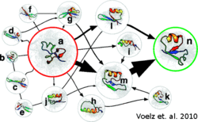

MSMBuilder
==========

MSMBuilder is an open source software package for automating the construction and analysis of Markov state models (MSMs). It is primarily written in the python programming language (optimized C extensions are used where appropriate to accelerate the calculations).

MSMs are a powerful means of modeling the structure and dynamics of molecular systems, like proteins. An MSM is essentially a map of the conformational space a molecule explores. Such models consist of a set of states and a matrix of transition probabilities (or, equivalently, transition rates) between each pair of states. Intuitively, the states in an MSM can be thought of as corresponding to local minima in the free energy landscape that ultimately determines a molecule’s structure and dynamics.

.. raw:: html
 
  

  <h2 style="display: inline; float:left; margin-left:2em"><a href="https://github.com/SimTk/msmbuilder/releases">
  Download MSMBuilder</a></h2>
  <h2 style="display: inline; float:right; margin-right:2em"> <a href="https://mailman.stanford.edu/mailman/listinfo/msmbuilder-user"> Get on the Mailing List
  </a></h2>
  

  

MSMBuilder has been designed to provide both ease of use and versatility. To facilitate the workflows of both novices and experts, we have designed MSMBuilder with two modes of operations:

#. MSMBuilder is a set of command line toos

#. MSMBuilder is a python library.

The command line tools allow most users to work without writing a single line of
Python code. Advanced users can write their own Python scripts using the
MSMBuilder library.

Documentation
=============

.. toctree::
   :maxdepth: 1

   installation
   tutorial
   ward_and_scre_tutorial
   publications
   commands
   faq
   whats_new
   developer

MSM Theory Notes
================

.. toctree::
   :maxdepth: 1
   
   theory/tICA
   theory/autocorrelation
   theory/mle_transition_matrix

Library API Reference
=====================

.. toctree::
   :maxdepth: 1

   api/MSMLib
   api/msm_analysis
   api/assigning
   api/clustering
   api/drift
   api/cfep
   api/SCRE
   api/tICA

Indices and tables
==================

* :ref:`genindex`
* :ref:`modindex`
* :ref:`search`
