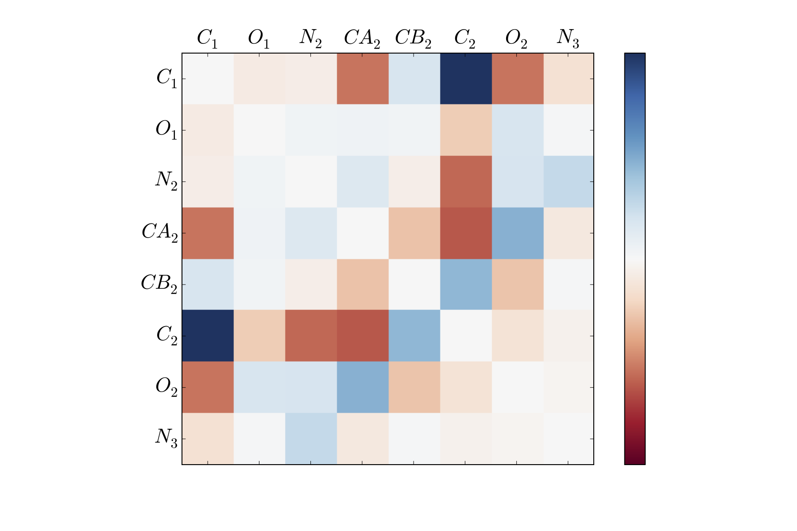

Time-Structure Based Independent Component Analysis (tICA)
==========================================================

Introduction
~~~~~~~~~~~~

The time-structure based Independent Component Analysis (tICA) method as
applied to MSM construction is a new way to judge distances in the
protein conformational landscape. The strategy will be to define a
reduced dimensional representation of the protein conformations, and use
distances in this space in the clustering step of the MSM construction
process. Consider a single, long trajectory from a simulation,
:math:`\mathbf{X}(t) \in \mathbb{R}^d`, which has :math:`d` dimensions
each corresponding to some structural degree of freedom (such as a
single phi angle).

One natural way we could define the reduced space is to use Principal
Component Analysis, or PCA (See Gerhard Stock’s work for examples). In
PCA, the goal is to find projection vectors that maximize their
explained variance, subject to them being uncorrelated and having length
one. In the end, these maximal variance projections correspond to the
solutions of the following eigenvalue problem:

.. math:: \Sigma v = \lambda v

where :math:`\Sigma` is the covariance matrix given by:

.. math:: \Sigma_{ij} = \mathbb{E}\Big[ X_i(t) X_j(t) \Big]

The problem with using PCA to define the reduced space, however, is
that high-variance degrees of freedom need not be slow (for instance
consider a floppy protein tail that varies wildly vs. a single dihedral
angle that is required to rotate for a protein to fold). What we really
want is to design projections that can best differentiate between slowly
equilibrating populations, which is precisely where tICA comes in.

In tICA, the goal is to find projection vectors that maximize their
autocorrelation function, subject to them being uncorrelated and having
unit variance. It is easy to show (see Schwantes, CR and Pande, VS.
*JCTC* **2013**, 2000-2009.) that the solution to the tICA problem are
the solutions to this generalized eigenvalue problem (which is closely
related to the PCA eigenvalue problem):

.. math:: C^{(\Delta t)} v = \lambda \Sigma v

where :math:`C^{(\Delta t)}` is the time lag correlation matrix defined
by:

.. math:: C^{(\Delta t)}_{ij} = \mathbb{E}\Big[ X_i(t) X_j(t+\Delta t) \Big]

Given this solution, we can use the tICA method to define a reduced
dimensionality representation of each :math:`\mathbf{X}(t)` by
projecting the vector onto the slowest :math:`n` tICs. Therefore, the
strategy for using tICA to construct an MSM looks like:

#. Calculate :math:`C^{(\Delta t)}` and :math:`\Sigma` and the solutions
   to the generalized eigenvalue problem given above

#. Choose the number of tICs to project onto

#. Use the reduced space to cluster and assign conformations to states

#. Build the MSM from these assignments and analyze as laid out in the
   MSMBuilder tutorial

In the next section we will go over how to do each of these steps within
MSMBuilder.

Selection of tICA Parameters
~~~~~~~~~~~~~~~~~~~~~~~~~~~~

There are two parameters introduced in the tICA method. The first is
:math:`\Delta t`, which is used in the calculation of the time-lag
correlation matrix (:math:`C^{(\Delta t)}`). The second is :math:`n`,
which is the number of tICs to project onto when calculating distances
between conformations.

There is currently no optimal method for choosing these parameters,
however, the method has been fairly robust to different choices.

In previous analyses of Fip35, villin, NTL9(1-39), and NuG2,
:math:`\Delta t` between 50 and 1000 nanoseconds produced MSMs with
largely the same timescale distribution, indicating that something in
this range should be appropriate for most protein systems.

MSMs are more sensitive, however, to the selection of the number of tICs
to project onto. In the previous analyses listed above, we found that
using a surprisingly small number (in the range of 5-20) of tICs worked
well. The power behind tICA is to ignore the degrees of freedom that
quickly decorrelate and only add noise in the distance calculation.
However, as :math:`n` gets smaller (and we throw out more degrees of
freedom), the resolution of the MSM becomes limited, and can only
discern between conformations along the slowest coordinate (which is
often the folding process).

For example, in our analysis of NTL9, we found that increasing :math:`n`
from three up to seven kept the folding timescale largely unchanged but
added new microsecond timescales to the resulting MSMs, while adding in
too many (:math:`> 10`) produced a folding timescale that was too fast.

Understanding the tICs
~~~~~~~~~~~~~~~~~~~~~~

The top tICs represent linear combinations of the input degrees of
freedom that decorrelate slowly. These vectors are not necessarily easy
to visualize, however.

For instance, the slowest tIC from the above analysis can be visualized
as a matrix, where each entry corresponds to the tIC entry corresponding
to a pair of atoms’ distances.

Here, the dark blue and dark red portions correspond to atom pairs that
best distinguish between far regions along the first tIC. As is clear,
this is not all that helpful to look at (though an area that could be
greatly improved is providing a visualization tool for these degrees of
freedom).

We can also attempt to visualize the tICs by comparing the projections
onto each tIC to order parameters. For instance, for each conformation
we sampled in the reference simulations, we can calculate the phi and
psi angles along with the projection of the conformation onto each tIC.
In this way, we can visualize what each tIC corresponds to. Below, we
have plotted the phi and psi angles colored by that conformation’s
projection onto each tIC.

.. figure:: ../ _static/tics_crop.png

Drawbacks of tICA
~~~~~~~~~~~~~~~~~

Since part of the process of using tICA is a dimensionality reduction,
there is always the opportunity to throw out important pieces of
information. In particular, by throwing out the faster degrees of
freedom, we can better estimate the slowest timescales; but this comes
with the trade-off of not representing the fast timescales correctly.
The result is illustrated when trying to sample a trajectory from the
MSM built on tICA. The result is a trajectory that represents the
folding/unfolding transition well, but when in the unfolded state jumps
around more than would be seen in a typical MD simulation.
