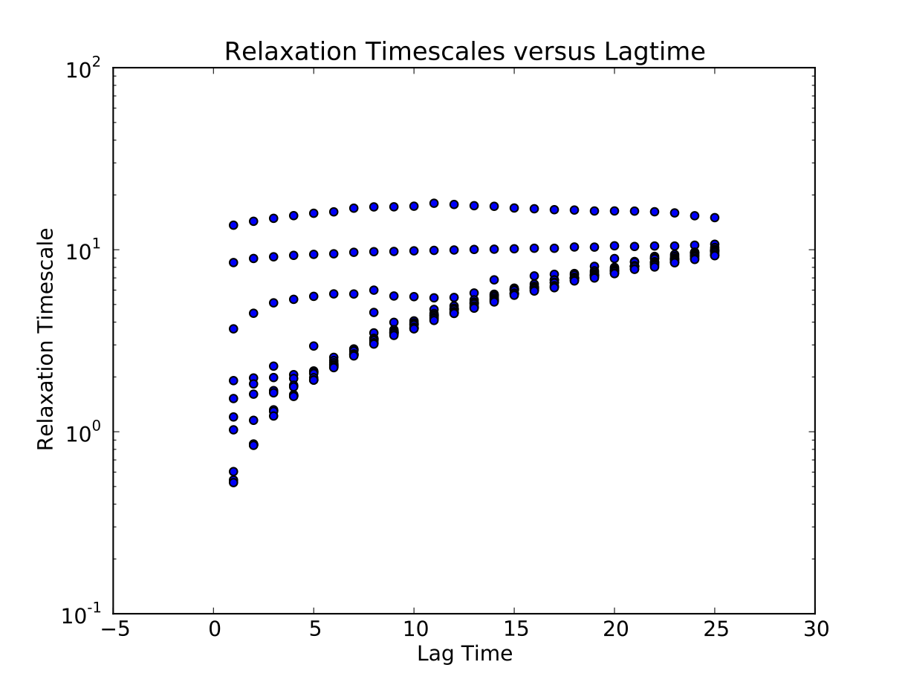
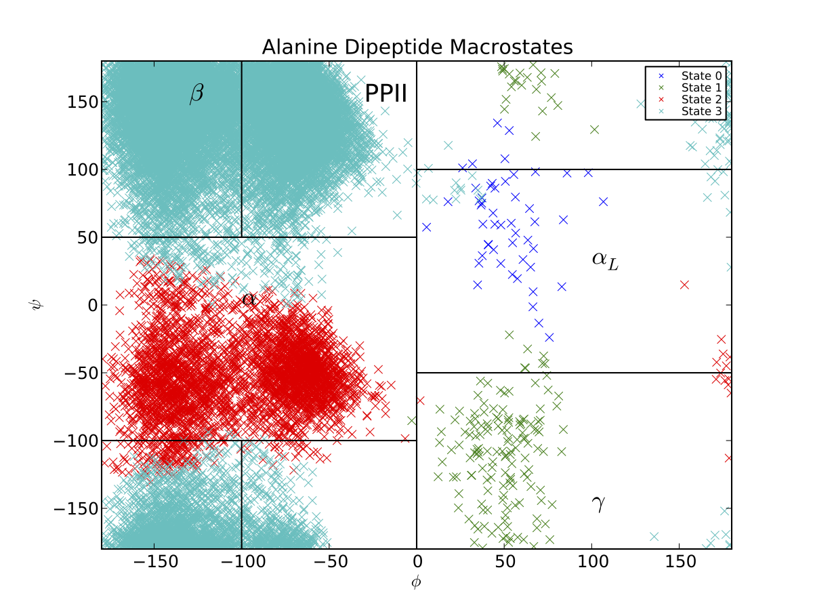
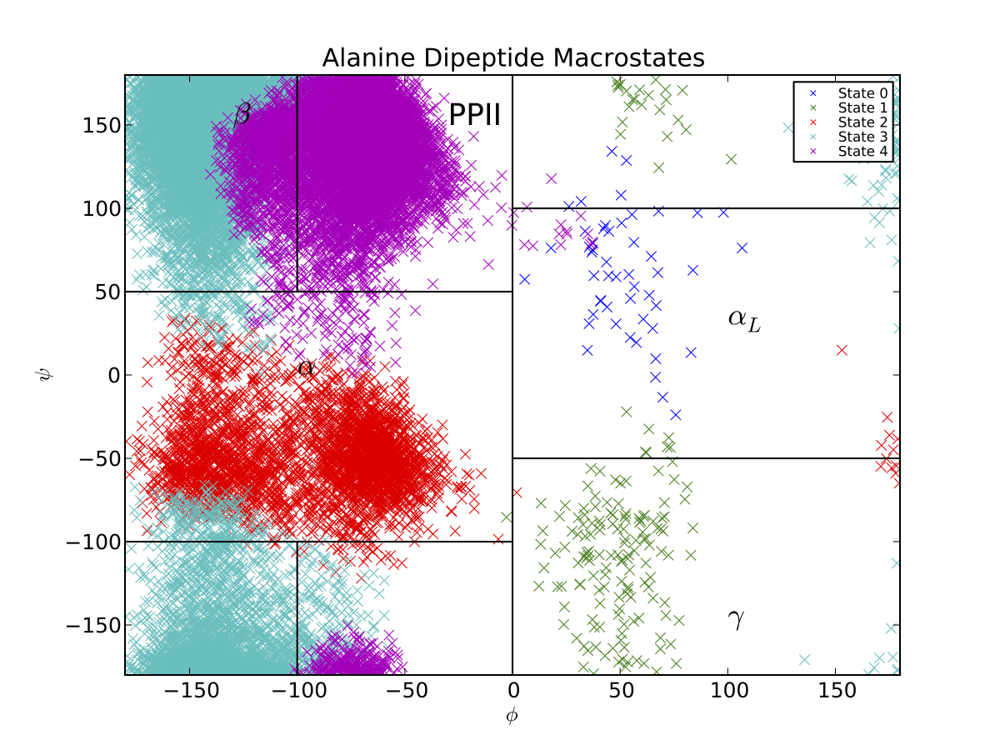

Tutorial : Introduction and Alanine Dipeptide
=============================================

Overview of MSM Construction
----------------

Constructing a Markov State model involves several steps, which are
summarized below:

#. Simulate the system of interest.

#. Convert trajectory data to MSMBuilder format.

#. Cluster and assign your data to determine microstates.

#. Construct a microstate MSM

#. Validate microstate MSM

#. Calculate macrostates using PCCA+

Alanine Dipeptide Tutorial
--------------------------

This section walks users through a complete Markov state model analysis
of the Alanine Dipeptide data provided in MSMBuilder.

In the following, we assume that you have properly installed MSMBuilder.
We also assume that you unzipped the MSMBuilder source file into
directory  /msmbuilder/. If you unzipped the file elsewhere, you will
need to change the paths accordingly.

Finally, in this tutorial we assume that you have installed pymol for
viewing conformations.

Move to tutorial directory, prepare trajectories
~~~~~~~~~~~~~~~~~~~~~~~~~~~~~~~~~~~~~~~~~~~~~~~~

Assuming you've just downloaded and installed the package, move to the Tutorial directory.

::

    $ cd Tutorial 

Create an MSMBuilder Project
~~~~~~~~~~~~~~~~~~~~~~~~~~~~

::

    $ msmb ConvertDataToHDF  -s native.pdb -i XTC

Cluster your data
~~~~~~~~~~~~~~~~~

The following command clusters your data using the RMSD metric using a
hybrid k-centers k-medoids approach. K-centers clustering continues
until the intercluster distance (-d) is 0.045 nm. At that point, 50
iterations (-l) of hybrid k-medoids are performed to refine those
clusters.

::

    $ msmb Cluster rmsd hybrid -d 0.045 -l 50

After clustering, one must assign the data to the clusters. For the
clustering settings used above, this happens automatically, so you will
not need to run a separate assignment step. For other clustering
protocols, you may need to run Assign.py or AssignHierarchical.py after
the clustering phase.

The assignments of each conformation are stored as Data/Assignments.h5.
The cluster centers are stored as Data/Gens.lh5.

Note that clustering with the RMSD metric requires a list of which atom
indices to use during RMSD calculation. This file is typically called
AtomIndices.dat and can typically be created using the script
CreateAtomIndices.py. Because alanine dipeptide contains non-standard
atom names, it cannot be generated automatically; a default
AtomIndices.dat has already been placed in the Tutorial directory for
your use. Note that AtomIndices.dat uses *zero* based indexing–the first
atom in your system has index 0.

Alternative Clustering Protocols
~~~~~~~~~~~~~~~~~~~~~~~~~~~~~~~~

Note that other clustering protocols (e.g. Ward’s algorithm) often leads
to improved models; see the AdvancedMethods tutorial for details.

Validate microstate model with relaxation timescales.
~~~~~~~~~~~~~~~~~~~~~~~~~~~~~~~~~~~~~~~~~~~~~~~~~~~~~

We calculate the relaxation timescales for a sequence of lagtimes
:math:`\{1, 2, ..., 25\}`:

::

    $ msmb CalculateImpliedTimescales -l 1,25 -i 1 -o Data/ImpliedTimescales.dat

Next, we use python to plot the results, specifying the lagtime between
frames (1 ps):

::

    $ msmb PlotImpliedTimescales -d 1. -i Data/ImpliedTimescales.dat

Construct MSM at appropriate lagtime
~~~~~~~~~~~~~~~~~~~~~~~~~~~~~~~~~~~~

The plotted relaxation timescales suggest that the three slow timescales
are reasonable flat at a lagtime of 3 timesteps [ps]. Thus, we construct
an MSM using that lagtime:

::

    $ msmb BuildMSM -l 3 

At this point, MSMBuilder has written the following files into your
./Data/ directory:

::

    Assignments.Fixed.h5
    tCounts.mtx
    tProb.mtx
    Mapping.dat
    Populations.dat

Assignments.Fixed.h5 contains a “fixed” version of your microstate
assignments that has removed all data that is trimmed the maximal
ergodic subgraph of your data.

tCounts.mtx contains the maximum likelihood estimated reversible count
matrix. This is a symmetric matrix.

tProb.mtx contains the maximum likelihood estimated transition
probability matrix.

Mapping.dat contains a mapping of the original microstate numbering to
the “fixed” microstate numbering. This is necessary because some states
may have been discarded during the ergodic trimming step.

Populations.dat contains the maximum likelihood estimated reversible
equilibrium populations.

Construct a Macrostate MSM
~~~~~~~~~~~~~~~~~~~~~~~~~~

Spectral clustering methods such as PCCA+ can be used to construct
metastable models with a minimal number of states. You may also be
interested in trying a Bayesian method called BACE that appears to
outperform existing spectral methods. However, for the purpose of this
Tutorial, we will focus on the more standard spectral methods.

First, we need to construct a microstate model with a short lagtime. The
short lagtime is necessary because PCCA+ tries to create macrostates
that are long-lived, or metastable. At long lagtimes, states become less
and less metastable.

::

    $ msmb BuildMSM -l 1 -o L1

Our previous examination of the relaxation timescales suggested that
there were 3 slow processes, so we choose to build a model with 4
macroscopic states.

::

    $ msmb PCCA -n 4 -a L1/Assignments.Fixed.h5 -t L1/tProb.mtx -o Macro4/ -A PCCA+

Examining the macrostate decomposition
~~~~~~~~~~~~~~~~~~~~~~~~~~~~~~~~~~~~~~

It is known that the relevant degrees of freedom for alanine dipeptide
are the phi and psi backbone angles. Thus, it is useful to examine
(phi,psi). This data has been pre-calculated and is stored in
Dihedrals.h5, or you can compute it via

::

    $ python GetDihedrals.py --pdb native.pdb -a Macro4/MacroAssignments.h5 -n 1000

This will sample up to 1000 conformations from each macrostate. To
sample all macrostates, use -n -1. We then visualize the data.

::

    $ python PlotDihedrals.py Dihedrals.h5

You should see something like the following graph (our clustering and
PCCA+ code both perform randomized searches, so your plot may appear
slightly different):

Thus, the PCCA algorithm has automatically identified the key basins of
alanine dipeptide. The black lines correspond to the
:math:`\beta, PP_{II}, \alpha_R, \alpha_L` and :math:`\gamma`
conformational basins, as estimated previously . If we want a model that
is less coarse grained, we can build a macrostate MSM with more states.
If, for example, we had used 5 states, we would produce a Ramachandran
plot that also captures the barrier between the :math:`\beta` and
:math:`PP_{II}` basins.

In general, PCCA and PCCA+ are best applied to capturing long-lived,
metastable states. Thus, for this system, applying PCCA+ to construct
models with more than 5 states may not produce useful models. This is
because alanine dipeptide only contains four eigenvalues that are
significantly slower than the time resolution of 1 ps.

Calculate Macrostate Implied Timescales
~~~~~~~~~~~~~~~~~~~~~~~~~~~~~~~~~~~~~~~

::

    $ msmb CalculateImpliedTimescales -l 1,25 -i 1 \
    -o Macro4/ImpliedTimescales.dat -a Macro4/MacroAssignments.h5 -e 3

    $ msmb PlotImpliedTimescales -i Macro4/ImpliedTimescales.dat -d 1

Occasionally, PCCA+ will lead to poor macrostates, so it is important to
verify that:

#. The state decomposition makes physical sense

#. The macrostate implied timescales make sense

#. The macrostate implied timescales “follow” the microstate implied
   timescales

Furthermore, PCCA+ is best used to estimate metastable states. Here are
some additional guidelines for achieving good success with PCCA+:

#. If your microstate model has too *long* of a lagtime, the model may
   not be metastable because significant dynamics occurs on the
   timescale of a single lagtime.

#. If your microstate model has too *short* of a lagtime, the microstate
   model may not be Markovian, leading to errors when estimating the
   eigenvalues and eigenvectors. Most importantly, significant
   non-Markovian dynamics can cause the slowest eigenvalues to be
   mis-identified. If this occurs, your PCCA+ model will be worthless!
   To prevent this, a useful guide is to make sure that the slowest
   implied timescales do not cross one another (e.g. their rank ordering
   is constant).

#. If your microstate model has too *few* states, your microstate model
   may not be sufficiently Markovian. You may not have sufficient
   geometric resolution to accurately identify the primary kinetic
   barriers.

#. If your microstate model has too *many* states, your microstate model
   will have poor statistics, possibly leading to poor estimates of the
   slow eigenvectors.

Thus, success with PCCA+ may require some trial and error when selecting
the appropriate lagtime and microstate clustering. Finally, note that
our implementation of PCCA+ uses a simulated annealing minimization.
This randomized search means that you may find multiple minima by
repeating the PCCA+ calculation several times. You may find a better
model by repeating the calculation several times.

Visualizing Structures with Pymol
~~~~~~~~~~~~~~~~~~~~~~~~~~~~~~~~~

Because macrostate models typically have a handful of states, it is easy
for humans to compare the resulting structures visually. One way to do
this is to save randomly selected conformations from each state, then
view them in Pymol (or VMD):

::

    $ msmb SaveStructures -s -1 -f pdb -S sep -a Macro4/MacroAssignments.h5
    pymol PDBs/State0-0.pdb PDBs/State1-0.pdb PDBs/State2-0.pdb PDBs/State3-0.pdb

.. figure:: _static/ala.png

   Randomly selected conformations from the four macrostate model.
   Colored by macrostate.
