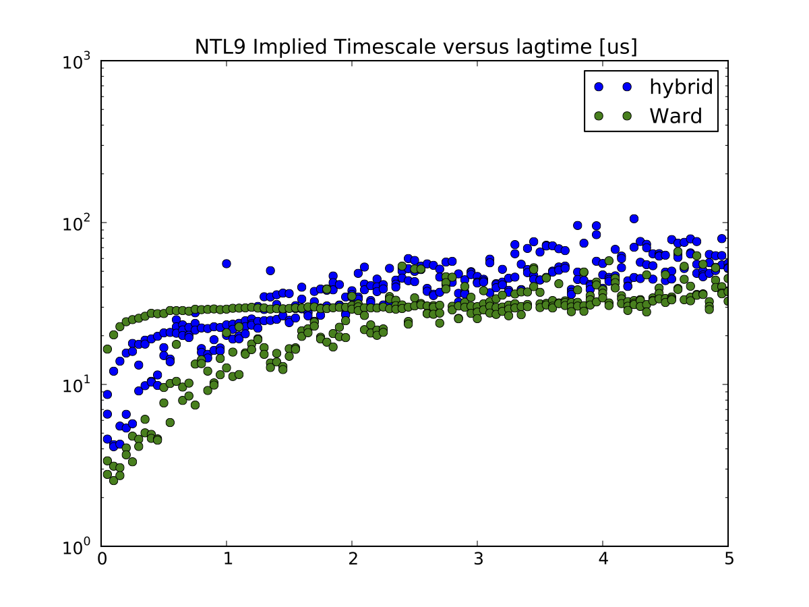
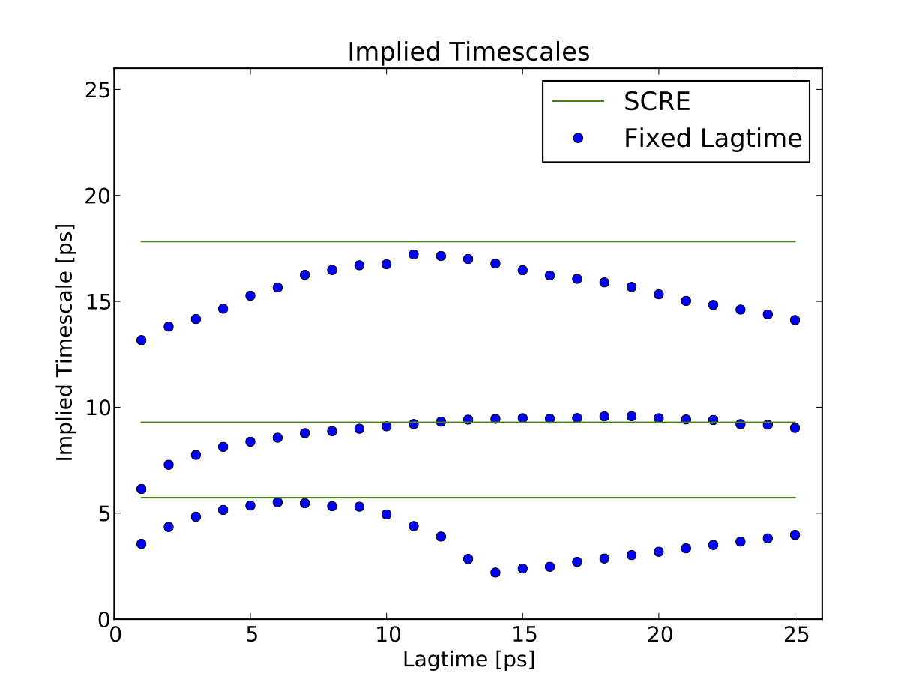

Tutorial : Additional Methods
=============================

Cluster your data using Ward’s algorithm and the RMSD metric
------------------------------------------------------------

MSMBuilder provides multiple clustering algorithms. In the ’basic’
tutorial, we used a hybrid k-centers k-medoids algorithm. That algorithm
is quite fast, but more advanced clustering algorithms can lead to
better models. In particular, we have found that Ward clustering
provides two key advantages over k-centers :

#. Improved statistics in each state–that is, few states will have
   “poor” statistics.

#. Ward clustering typically leads to slower, more converged implied
   timescales. This is due Ward better separating kinetically distinct
   regions of conformation space.

Note that the key disadvantage of Ward is that it requires large amounts
of memory.

WARNING: this step requires a minimum of 3.0 GB of memory for storing a
matrix of pairwise RMSD.

::

    Cluster.py rmsd hierarchical

As example, the following figure shows that Ward clustering leads to
improved implied timescales, as compared to Hybrid clustering:

Estimate a rate matrix using SCRE
---------------------------------

In the macrostate implied timescales, the slowest implied timescale
converges at approximately 10 ps, while the third timescale converges as
5 ps. Furthermore, the third timescale is aliased at lagtimes starting
with 14 ps; lagtimes longer than 14 ps will not accurately capture the
dynamics of this relaxation. This suggests that this system might
benefit from estimating rates using SCRE and multiple lagtimes . Note
that SCRE currently is practical only for models with few states
(:math:`n \le 10`).

To build an SCRE model, we first construct a macrostate transition
matrix with lagtime 1.

::

     BuildMSM.py -l 1 -a Macro4/MacroAssignments.h5 -o Macro4/

The key idea in SCRE is to estimate rate matrix :math:`K_{ij}(\tau)` for
a variety of lagtimes. Then, each rate matrix element is fixed when
:math:`K_{ij}(\tau)` becomes approximately constant with respect to the
lagtime :math:`\tau`. The final rate matrix provides estimates of
Markovian rates for each of the rate elements :math:`K_{ij}`.

Next, we run an interactive script to estimate rates using SCRE.

::

     Interactive-SCRE.py -a Macro4/Assignments.Fixed.h5 -o Macro4

In practice, the script will prompt the user to select a maximum
lagtime. The script then estimates and plots rate matrices for each
lagtime up to the maximum value. The user is then asked to identify
converged rate matrix elements. In general, one should try to estimate
the quickly-convergign rates first. After those rates are constrained,
one can then try to estimate the slower and / or less Markovian rates.
For concreteness, I used the following inputs:

25 1,0,6 25 3,2,19 25 3,1,6 25 3,0,9 25 14

Note that on the last iteration, the user is asked only to select a
lagtime. Also note that your choices may be different because of
differences in the macrostate definitions; the PCCA+ minimization uses a
non-deterministic simulated annealing. Also, if your state decomposition
is insufficiently Markovian, you may find that the plotted rate
estimates show a “periodic” behavior. This likely indicates that a given
macrostate contains multiple slowly interconverting substates; as you
increase the lagtime, the model switches from the faster process to the
slower process. In such situations, your best bet is to increase the
number of macrostates.

Finally, we compare the fixed-lagtime and SCRE estimates of implied
timescales:

::

     python PlotMacrostateImpliedTimescales.py

We find that the SCRE estimates capture the “converged” values of the
fixed-lagtime timescales. Achieving convergence for each timescale is
not possible with a fixed-lagtime MSM, because the 20 ps lagtime
required for the second relaxation causes the third relaxation to alias.

